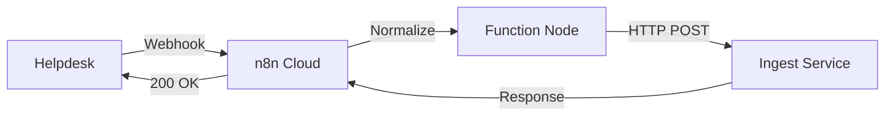

# Front Desk Webhook Integration Guide

This guide covers setting up the n8n webhook flow to receive helpdesk events and forward them to our ingest service.

## Table of Contents
- [Overview](#overview)
- [n8n Cloud Setup](#n8n-cloud-setup)
- [Helpdesk Configuration](#helpdesk-configuration)
- [Testing & Validation](#testing--validation)
- [Troubleshooting](#troubleshooting)

## Overview

The Front Desk webhook system:
1. Receives events from helpdesks (Zammad/FreeScout)
2. Normalizes data to our schema
3. Forwards to ingest service
4. Returns confirmation to helpdesk



## n8n Cloud Setup

### Step 1: Import the Workflow

1. Log into your n8n Cloud instance: `https://mmtuentertainment.app.n8n.cloud`
2. Navigate to **Workflows** → **Import from File**
3. Select `automation/n8n/frontdesk-intake.json`
4. Click **Import**


### Step 2: Configure Environment Variables

1. Go to **Settings** → **Variables**
2. Add these environment variables:

| Variable | Value | Description |
|----------|-------|-------------|
| `N8N_WEBHOOK_SECRET` | `your-secret-here` | Shared secret for authentication |
| `INGEST_BASE_URL` | `https://your-ingest.example.com` | Your M2 ingest service URL |


### Step 3: Review the Workflow

1. Open the imported workflow "Front Desk Intake"
2. Verify the nodes are connected:
   - **Webhook** → receives POST requests
   - **Normalize Data** → maps to our schema
   - **HTTP Request** → sends to ingest
   - **Respond to Webhook** → returns response


### Step 4: Configure Webhook Node

1. Click on the **Webhook** node
2. Verify settings:
   - Method: `POST`
   - Path: `frontdesk/intake`
   - Authentication: `Header Auth`
   - Header Name: `x-signature`
   - Header Value: Uses `N8N_WEBHOOK_SECRET` variable
   - Response: `When Last Node Finishes`


### Step 5: Activate and Get Production URL

1. Click **Activate** in the top-right corner
2. Click on the **Webhook** node again
3. Select **Production** tab (NOT Test)
4. Copy the **Production URL**
   - Format: `https://mmtuentertainment.app.n8n.cloud/webhook/[id]/frontdesk/intake`


**⚠️ IMPORTANT**: Always use the **Production URL**, not the Test URL. The Test URL only works when the workflow is open in the editor.

## Helpdesk Configuration

### Zammad Setup

1. Navigate to **Admin** → **Webhook** → **Add Webhook**
2. Configure:

| Field | Value |
|-------|-------|
| **Name** | Front Desk Intake |
| **Endpoint** | `[Your n8n Production URL]` |
| **Signature Token** | `[Your N8N_WEBHOOK_SECRET]` |
| **Custom Headers** | |
| - `x-frontdesk-source` | `zammad` |
| - `x-signature` | `[Your N8N_WEBHOOK_SECRET]` |
| **Events** | ✅ Ticket Create<br>✅ Ticket Update |
| **Active** | ✅ Yes |

3. Custom Payload:
```json
{
  "ticket_id": "#{ticket.id}",
  "subject": "#{ticket.title}",
  "body": "#{article.body}",
  "status": "#{ticket.state.name}",
  "priority": "#{ticket.priority.name}",
  "category": "#{ticket.group.name}",
  "tags": #{ticket.tag_list},
  "customer": {
    "email": "#{ticket.customer.email}",
    "name": "#{ticket.customer.fullname}",
    "phone": "#{ticket.customer.phone}",
    "language": "#{ticket.customer.preferences.locale}",
    "timezone": "#{ticket.customer.preferences.timezone}"
  }
}
```


### FreeScout Setup

1. Go to **Manage** → **Webhooks** → **New Webhook**
2. Configure:

| Field | Value |
|-------|-------|
| **URL** | `[Your n8n Production URL]` |
| **Secret** | `[Your N8N_WEBHOOK_SECRET]` |
| **Events** | ✅ conversation.created<br>✅ conversation.customer_replied<br>✅ conversation.agent_replied |
| **Headers** | |
| - `x-frontdesk-source` | `freescout` |
| - `x-signature` | `[Your N8N_WEBHOOK_SECRET]` |
| **Active** | ✅ Yes |
| **Retry on Failure** | ✅ Yes (max 3 attempts) |


## Testing & Validation

### 1. Local Test Script

Run the provided test script:

```bash
# Set environment variables
export N8N_WEBHOOK_PROD_URL="https://mmtuentertainment.app.n8n.cloud/webhook/[id]/frontdesk/intake"
export N8N_WEBHOOK_SECRET="your-secret-here"

# Run test
./scripts/test-webhook.sh
```

Expected response:
```json
{
  "id": "01J5ZR8K1HNMVK0JQYXG2P3D4C",
  "status": "ingested",
  "source": "local-test",
  "subject": "Ping",
  "contact": {
    "email": "ops@example.com",
    "language": "en-US",
    "timezone": "America/New_York"
  },
  "priority": "P3",
  "timestamp": "2024-08-24T18:30:00.000Z"
}
```

### 2. n8n Execution Check

1. Go to n8n **Executions** tab
2. Verify execution shows:
   - ✅ Success status
   - All 4 nodes executed
   - No errors


### 3. Ingest Service Validation

Check that the ingest service received the data:

```bash
# Check latest entries in JSONL
tail -5 front-desk/log.jsonl

# Should show new entry with your test data
```

### 4. Helpdesk Test

1. Create a test ticket in your helpdesk
2. Check n8n Executions for new run
3. Verify ingest received the data
4. Confirm helpdesk shows webhook as delivered

## Acceptance Checklist

- [ ] n8n workflow imported and activated
- [ ] Environment variables configured (`N8N_WEBHOOK_SECRET`, `INGEST_BASE_URL`)
- [ ] Production webhook URL copied (not test URL)
- [ ] Helpdesk webhook configured with correct headers
- [ ] Test script returns 200 with valid JSON
- [ ] n8n execution shows success for all nodes
- [ ] Ingest service returns `{ "id": "01..." }`
- [ ] JSONL file has new entry appended
- [ ] Helpdesk shows webhook delivery success

## Troubleshooting

### Common Issues

#### 1. 401 Unauthorized
- **Cause**: Signature mismatch
- **Fix**: Ensure `x-signature` header matches `N8N_WEBHOOK_SECRET` exactly

#### 2. 404 Not Found
- **Cause**: Using test URL or workflow not activated
- **Fix**: Use Production URL and ensure workflow is activated

#### 3. 500 Internal Server Error
- **Cause**: Ingest service unreachable or error
- **Fix**: Check `INGEST_BASE_URL` is correct and service is running

#### 4. No Execution in n8n
- **Cause**: Webhook not reaching n8n
- **Fix**: Check helpdesk webhook URL and network connectivity

#### 5. Data Not in JSONL
- **Cause**: Ingest service error
- **Fix**: Check ingest logs, ensure proper permissions on JSONL file

### Debug Mode

To enable detailed logging:

1. In n8n workflow, add a **Function** node after each step
2. Log the data: `console.log('Data:', JSON.stringify($json, null, 2))`
3. Check execution details for logged output

### Support Channels

- n8n Issues: Check execution logs in n8n Cloud UI
- Ingest Issues: Review `front-desk/ingest/server.js` logs
- Network Issues: Use `curl` to test connectivity directly

## Next Steps

After successful setup:

1. Monitor initial production events
2. Set up alerting for failed executions
3. Configure backup webhook endpoint
4. Document any custom field mappings needed

## Screenshot Placeholders

The following screenshots should be captured during actual setup:

1. `01-import-workflow.png` - Import dialog in n8n
2. `02-env-variables.png` - Environment variables configuration
3. `03-workflow-overview.png` - Complete workflow view
4. `04-webhook-config.png` - Webhook node configuration
5. `05-production-url.png` - Production URL location
6. `06-zammad-webhook.png` - Zammad webhook configuration
7. `07-freescout-webhook.png` - FreeScout webhook configuration
8. `08-execution-success.png` - Successful execution view